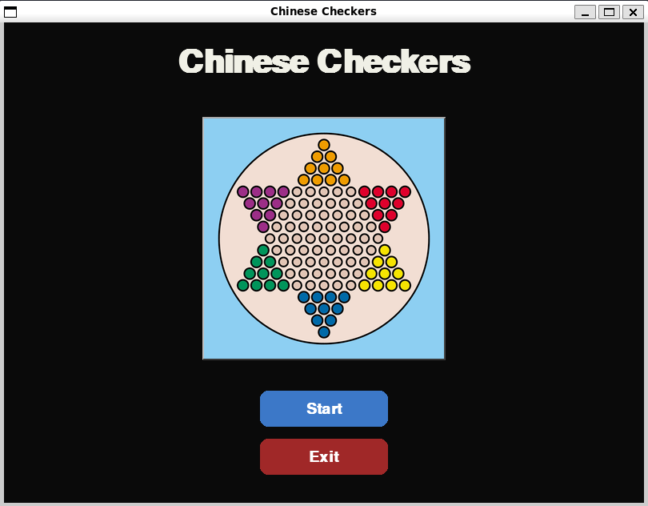
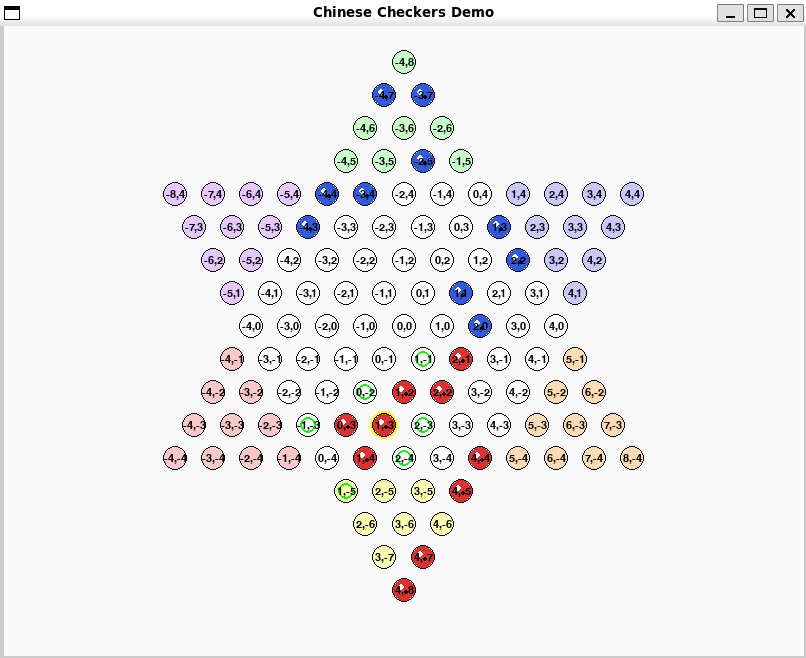

# Chinese Checkers with AI  
*Final Project for CPSC 481 - Artificial Intelligence*

A Python implementation of a **simplified Chinese Checkers game** with an AI opponent.  
Built as a final project for **CPSC 481** at California State University, Fullerton.  
The game uses Pygame for the GUI and features single-move-per-turn rules and a minimax-based computer player.  
**The AI search depth is set to 2 for fast response and smooth gameplay performance.**

## Features

- **Modern, clickable GUI** using Pygame
- **Player vs AI** mode with turn-taking
- **Minimax AI** with alpha-beta pruning for challenging computer moves  
  *(AI search depth is set to 2 for good speed and responsiveness)*
- **Move highlighting** and interactive piece selection
- **Automatic win detection** and board reset
- **Easily extensible** for more features or fancier UI

## About This Version

- This is a **simplified version** of Chinese Checkers:
  - Each turn, a player may move or jump only once (no chained jumps).
  - Only two players (you and the AI).
  - The board and move logic have been reduced for clarity and gameplay speed.
  - **AI depth is set to 2 by default for performance reasons.**
- Designed as a learning project for exploring game AI, event-driven GUI programming, and board game logic in Python.

## How to Play

1. **Start the game:**  
   Run the main Python file. A window will appear with the board and pieces.
2. **Your turn (Red pieces):**
   - Click a red piece to select it.
   - Valid moves will be highlighted in green.
   - Click a highlighted space to move your piece.
   - You may select a different piece by clicking on another red piece.
3. **AI's turn (Blue pieces):**
   - The AI will automatically move a blue piece after your move.
   - The turn returns to you once the AI finishes.
4. **Win detection:**
   - If you move all your pieces into the opponent’s starting area, you win!
   - If the AI does so, the AI wins.
   - A win message appears and the game automatically resets.

## Installation

1. **Clone this repo**  
   ```bash
   git clone <https://github.com/3374128044/ChineseChecker.git>
   cd <https://github.com/3374128044/ChineseChecker.git>
   ```
2. **Install requirements**  
   ```bash
   pip install pygame
   ```
3. **Run the game**  
   ```bash
   python main.py
   ```

## File Structure

- `gameBoard.py` — Board data structure and movement logic
- `gameLogic.py` — Move validation and win-checking
- `aiAgent.py` — Minimax AI logic
- `GameBoardGUI.py` — Drawing and GUI event mapping
- `GameBoardController.py` — Main game loop and event controller (or part of main.py)

## Code Overview

- **Model:** `gameBoard` and `node` — Board state, piece positions, legal moves
- **View:** `GameBoardGUI` — Handles drawing board, pieces, highlights
- **Controller:** `GameBoardController` — Handles user input, turn logic, AI integration, win/reset logic
- **AI:** `aiAgent` — Minimax algorithm with alpha-beta pruning for competitive computer play

## Demo


